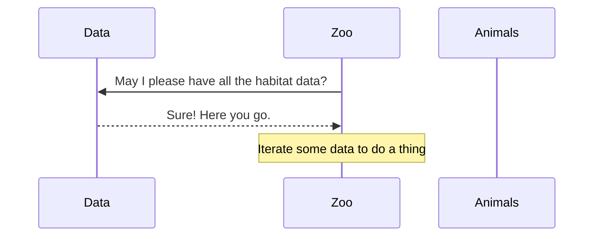

# Visualizing the Project

Time to make some pictures! Because sometimes the best way to understand code is to draw it out.

## Dependency Graph

First up: draw a dependency graph to show how all your modules connect. Did you organize by resource type? By functionality? This diagram will show your architectural choices in all their glory.

Start with your main `zoo.js` module, check out what it imports, and follow the connections from there.

Create a file with a `.md` extension (e.g., `dependency-graph.md`) and use the Mermaid Chart extension to preview your diagram.

## Sequence Diagram

Next: create a sequence diagram that shows your program's algorithm in action—like a movie script for your code!

You'll need to include a step for every function call and every loop. Yes, ALL of them. (Think of it as showing off how much work your code actually does.)

Create another file with a `.md` extension (e.g., `sequence-diagram.md`) and use the Mermaid Chart extension to preview your diagram.

Here's a tiny example to get you started. Your diagram will probably look totally different—and that's okay!

## Navigation

[← Previous: Chapter 6](./06_ZOO_CLEANUP.md) | [Home](../README.md)

