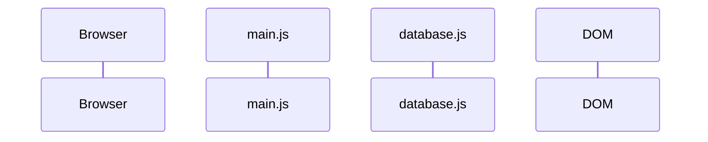

# Potion Shelf · Element Selection & DOM Manipulation

**Substandard:** `JS.SD.ELM`

**Chapter title:** State & DOM · Element Selection & Manipulation

**Project:** Potion Shelf

**Final chapter outcome:** Students render a list of potion names from data into the DOM and group the DOM update inside a `render()` function.

The final UI displays:

```html
<header>
  <h1>Potion Shelf</h1>
  <p>A tiny catalog for a magical shop.</p>
</header>

<main>
  <section>
    <h2>Available Potions</h2>
    <ul id="potion-list">
      <li>Mender's Sip</li>
      <li>Ember Tonic</li>
      <li>Glacier Draught</li>
      <!-- more potions -->
    </ul>
  </section>
</main>
```

This chapter's job is:

```txt
data -> HTML string -> DOM
```

No click handling. No dropdown. No filtering. No `data-*` attributes. No potion details panel yet.

---

## The Big Idea

HTML creates the starting page.

The browser turns that HTML into the DOM.

JavaScript can select parts of the DOM and change them.

For this chapter, students build the first rendering pipeline:

- select mount point
- render shell
- select nested list
- get array data
- turn one object into one HTML string
- name the one-object pattern with `PotionItem`
- map all objects into HTML strings
- join strings
- update `innerHTML`
- group the full render pipeline in `render()`

Work through the sidebar pages in order. Each page adds one small move and tells you what to keep before moving on.

---

## Flow Diagram

You learned how to write sequence diagrams while modularizing the National Cryptid Census. Potion Shelf keeps that skill in use while adding two new kinds of participants: the browser and the DOM.

The workbench includes an editable file named `/sequenceDiagram.mmd` with the participants already listed:



You already know the basic writing rules:

- `sequenceDiagram` declares the diagram type,
- `participant` names the parts involved,
- `->>` shows an interaction,
- `-->>` can show information returning,
- and the diagram reads from top to bottom.

Each page will ask you to revise `/sequenceDiagram.mmd` so it continues to match the current program. The Sequence Diagram panel will render your changes as you write them.

This time the diagram will help you track a browser-driven rendering pipeline:

```txt
browser -> JavaScript -> data/function calls -> DOM
```

The important habit is the same one you practiced in Modules: **derive the diagram from what the program actually does, and keep architectural relationships separate from runtime interactions.**
