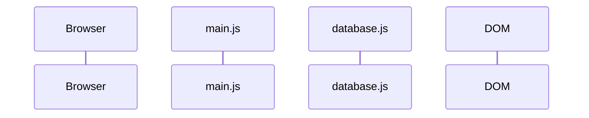

# Potion Shelf · Element Selection & DOM Manipulation

**Substandard:** `JS.SD.ELM`

**Chapter title:** State & DOM · Element Selection & Manipulation

**Project:** Potion Shelf

**Final chapter outcome:** Students render a list of potion names from data into the DOM.

By the end of Chapter 1, the app displays a simple Potion Shelf page:

```html
<header>
  <h1>Potion Shelf</h1>
  <p>A tiny catalog for a magical shop.</p>
</header>

<main>
  <section>
    <h2>Available Potions</h2>
    <ul>
      <li>Mender's Sip</li>
      <li>Ember Tonic</li>
      <li>Glacier Draught</li>
    </ul>
  </section>
</main>
```

This chapter's job is:

```txt
data -> HTML string -> DOM
```

No click handling. No dropdown. No filtering. No `data-*` attributes. No potion details panel yet.

---

## The Big Idea

HTML creates the starting page.

The browser turns that HTML into the DOM.

JavaScript can select parts of the DOM and change them.

For this chapter, students build the first rendering pipeline:

- select mount point
- render shell
- select nested list
- get array data
- turn one object into one HTML string
- map all objects into HTML strings
- join strings
- set `innerHTML`

Work through the sidebar pages in order. Each page adds one small move and tells you what to keep before moving on.

---

## Flow Diagram

You will also maintain one small sequence diagram as the app grows.

The goal is not to memorize Mermaid syntax yet. The goal is to keep a clear story of what happens first, next, and after that.

The workbench includes an editable file named `/sequenceDiagram.mmd` with this starter diagram:



Each page will ask you to add or replace a few lines in `/sequenceDiagram.mmd`. The Sequence Diagram panel will render that file as you revise it.

That matters because diagrams should match the current program, not every version of the program that ever existed.

Chapter 1 diagram skill target:

```txt
read -> add -> replace -> explain order
```

You are not drawing from scratch yet. You are maintaining a provided diagram as the render flow becomes more complete.
