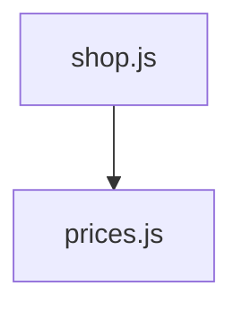
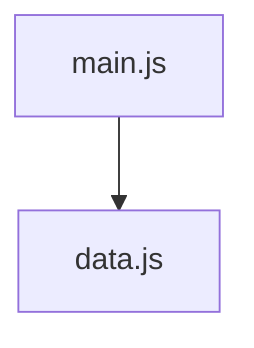

# Dependency Graphs → Draw the First Connection

The Census now has two modules:

```text
main.js
data.js
```

More importantly, those modules are not independent.

`main.js` contains:

```js
import { cryptids } from "./data.js";
```

That import tells us something about the architecture:

> `main.js` depends on `data.js`.

A **dependency graph** turns relationships like that into a picture.

## The question a dependency graph answers

A dependency graph answers:

> **Which module relies on which other module?**

It does not show every function call.

It does not show which line runs first.

It shows the structural connections between modules.

## Mermaid starts by naming the kind of diagram

Open `/dependencyGraph.mmd`.

A top-down Mermaid graph begins with:

```text
graph TD
```

`TD` means **top down**.

Then you add nodes and arrows.

Here is a different project:



Break that line apart:

| Piece | Meaning |
| --- | --- |
| `Shop` | Mermaid's short identifier for the node |
| `[shop.js]` | The label displayed in the box |
| `-->` | A dependency arrow |
| `Prices[prices.js]` | The module `shop.js` depends on |

The arrow follows the dependency.

If `shop.js` imports from `prices.js`:

```text
Shop --> Prices
```

The importer points toward the module it relies on.

## How to build a dependency graph from code

Use the same process every time:

1. List the modules in the project.
2. Read the import statements.
3. For each import, identify the importing module.
4. Identify the module named in the path.
5. Draw an arrow from the importer to that dependency.

Right now the Census has one import, so it has one dependency arrow.

<HandbookChallenge
  title="Draw the Census dependency"
  hints={[
    <>Begin the file with <code>graph TD</code>.</>,
    <>Create one labeled node for <code>main.js</code> and one for <code>data.js</code>.</>,
    <>The arrow starts at the module containing the import statement.</>,
  ]}
  expected={
    <pre className="m-0 whitespace-pre-wrap">{`graph TD
  Main[main.js] --> Data[data.js]`}</pre>
  }
  solution={
    <pre className="m-0 whitespace-pre-wrap">{`graph TD
  Main[main.js] --> Data[data.js]`}</pre>
  }
>
  <p className="m-0">
    Write the current project dependency graph in <code>/dependencyGraph.mmd</code>. Then open the <strong>Dependency Graph</strong> preview and make sure it shows <code>main.js</code> depending on <code>data.js</code>.
  </p>
</HandbookChallenge>

## Read the picture back into code

A useful diagram must be readable in both directions.

If you see:



you should be able to predict:

> Somewhere in `main.js`, there is an import whose source is `data.js`.

The graph is small now.

Good.

We will add another dependency only when the code gives us another dependency to draw.
