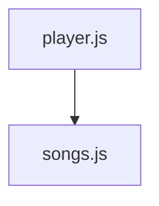
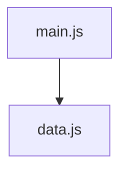

# Dependency Graphs → Draw the First Connection

A **dependency graph** turns the import relationships between modules into a picture.

## Why make a dependency graph?

Because planning matters.

When we map a program before changing it, we can see how its pieces fit together and predict where a change might cause problems. On a team, that same map helps people organize the work and avoid stepping on each other's toes.

Right now, dependency graphs also help you practice thinking like a computer. JavaScript doesn't look at a project and make an intuitive guess about how its files connect. It follows the import instructions you wrote. Tracing those connections one at a time helps you see the program the way JavaScript sees it—and that makes you a better programmer.

Our projects are still small enough that you might be able to keep every connection in your head. That's okay. We're learning the tool now so you'll know how to plan when your projects aren't so small.

## The question a dependency graph answers

A dependency graph answers:

> **Which module relies on which other module?**

It does not show every function call.

It does not show which line runs first.

It shows the structural connections between modules.

## Building our graph with Mermaid

To build our dependency graph, we'll use a tool called **Mermaid**. Mermaid turns text instructions into diagrams. Instead of drawing and connecting every box by hand, we can describe the diagram in a few lines of text and let Mermaid draw it for us.

Just like JavaScript, Mermaid needs us to be specific. We start by telling it what kind of diagram we want and which direction it should flow.

A top-down Mermaid graph begins with:

```text
graph TD
```

`TD` means **top down**.

Then you add nodes and arrows.

On the previous page, our music program connected its two modules with this import:

```js
// player.js
import { songs } from "./songs.js";
```

That tells us that `player.js` **depends on** `songs.js`—meaning it needs something from that module in order to run successfully. We can describe that relationship in Mermaid like this:

```text
graph TD
  Player[player.js] --> Songs[songs.js]
```

Break that line apart:

| Piece | Meaning |
| --- | --- |
| `Player` | Mermaid's short identifier for the node |
| `[player.js]` | The label displayed in the box |
| `-->` | A dependency arrow |
| `Songs[songs.js]` | The module `player.js` depends on |

The arrow follows the dependency.

Because `player.js` imports from `songs.js`:

```text
Player --> Songs
```

The importer points toward the module it relies on.

That gives us this graph when the Mermaid chart is rendered:


```mermaid
graph TD
  Player[player.js] --> Songs[songs.js]
```

## How to build a dependency graph from code

Use the same process every time:

1. List the modules in the project.
2. Read the import statements.
3. For each import, identify the importing module.
4. Identify the module named in the path.
5. Draw an arrow from the importer to that dependency.

The number of arrows comes from the code—not from how many files happen to be visible in the explorer.

Now inspect the Census files and build its graph from the import relationship you created.

<HandbookChallenge
  title="Draw the Census dependency"
  hints={[
    <>Begin the file with <code>graph TD</code>.</>,
    <>Create one labeled node for <code>main.js</code> and one for <code>data.js</code>.</>,
    <>The arrow starts at the module containing the import statement.</>,
  ]}
  expected={
    <MermaidDiagram source={`graph TD
  Main[main.js] --> Data[data.js]`} title="main.js depends on data.js" />
  }
  solution={
    <pre className="m-0 whitespace-pre-wrap">{`graph TD
  Main[main.js] --> Data[data.js]`}</pre>
  }
>
  <p className="m-0">
    Write the current project dependency graph in <code>/dependencyGraph.mmd</code>. Then open the <strong>Dependency Graph</strong> preview and make sure it shows <code>main.js</code> depending on <code>data.js</code>.
  </p>
</HandbookChallenge>

## Read the picture back into code

A useful diagram must be readable in both directions.

If you see:


```mermaid
graph TD
  Main[main.js] --> Data[data.js]
```

you should be able to predict:

> Somewhere in `main.js`, there is an import whose source is `data.js`.

The graph is small now.

Good.

We will add another dependency only when the code gives us another dependency to draw.
