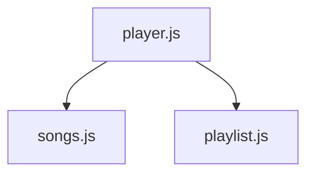

# Modules → Move One Function

Moving data is only one way to separate responsibilities. Reusable functions can have their own module too.

Our music program now imports its data from `songs.js`, but its playlist calculation still lives in `player.js`:

```js
// player.js
import { songs } from "./songs.js";

function getTotalMinutes(queue) {
  let total = 0;

  for (const song of queue) {
    total += song.minutes;
  }

  return total;
}

console.log(`Playlist length: ${getTotalMinutes(songs)} minutes`);
```

The calculation has a different job from running the player, so it can move to `playlist.js`:

```js
// playlist.js
function getTotalMinutes(queue) {
  let total = 0;

  for (const song of queue) {
    total += song.minutes;
  }

  return total;
}

export { getTotalMinutes };
```

Then `player.js` requests both the data and the function it still uses:

```js
// player.js
import { songs } from "./songs.js";
import { getTotalMinutes } from "./playlist.js";

console.log(`Playlist length: ${getTotalMinutes(songs)} minutes`);
```

The function moved. The call and the result did not.

That is the test of this refactor: code has a clearer home while the program keeps the same behavior.

## The architecture changed too

Before the move, `player.js` depended on `songs.js`.

Moving the function added another import relationship. Now the music program's dependency graph has two arrows:



The new arrow shows that `player.js` also depends on `playlist.js`.

This is why diagrams are maintained with the code. They describe the current project, not the project you had twenty minutes ago.

Now choose one Census function to move as directed in the challenge and update the Census graph from the imports that actually exist afterward.

<HandbookChallenge
  title="Move countConfirmed and update the graph"
  hints={[
    <>Move only <code>countConfirmed()</code> into <code>/census.js</code>.</>,
    <>Export the function by name and import that same name into <code>main.js</code>.</>,
    <>After the code works, read the imports in <code>main.js</code>. There are now two dependency arrows to draw.</>,
  ]}
  expected={
    <div className="space-y-3">
      <pre className="m-0 whitespace-pre-wrap">{`Confirmed: 6`}</pre>
      <MermaidDiagram source={`graph TD
  Main[main.js] --> Data[data.js]
  Main --> Census[census.js]`} title="Updated Census module dependency graph" />
    </div>
  }
  solution={
    <div className="space-y-3">
      <pre className="m-0 whitespace-pre-wrap">{`// census.js
function countConfirmed(records) {
  let count = 0;

  for (let i = 0; i < records.length; i++) {
    if (records[i].confirmed) {
      count++;
    }
  }

  return count;
}

export { countConfirmed };`}</pre>
      <pre className="m-0 whitespace-pre-wrap">{`// main.js
import { cryptids } from "./data.js";
import { countConfirmed } from "./census.js";`}</pre>
      <pre className="m-0 whitespace-pre-wrap">{`graph TD
  Main[main.js] --> Data[data.js]
  Main --> Census[census.js]`}</pre>
    </div>
  }
>
  <p className="m-0">
    Create <code>/census.js</code>, move <code>countConfirmed()</code> into it, and reconnect the program with a named export and import. Run the Census. Then update <code>/dependencyGraph.mmd</code> so the diagram matches both imports in <code>main.js</code>.
  </p>
</HandbookChallenge>

## Up Next

You moved one function into its own module and updated the dependency graph to match.

But modules aren't limited to exporting one thing at a time. Next, you'll learn how one module can provide several related functions without creating a separate file for every function.
