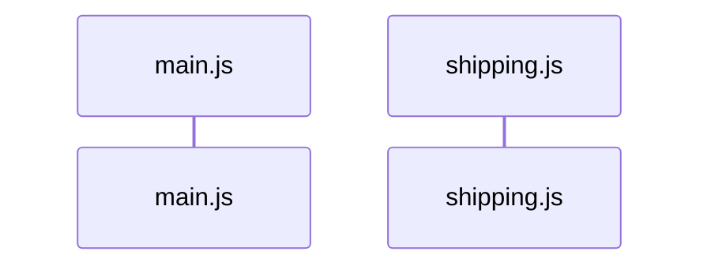
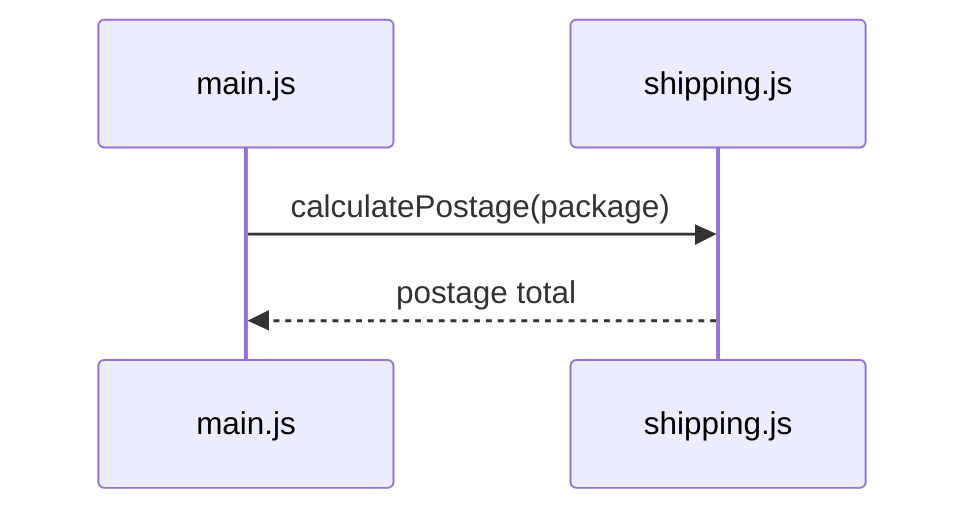

# Sequence Diagrams → Calls and Returns

Your dependency graph now answers a structural question:

> Which modules depend on which other modules?

It does **not** tell you what happens first when the program runs.

For that, we need a sequence diagram.

## A sequence diagram answers a different question

A **sequence diagram** shows interactions in time order.

Read from top to bottom.

If one module calls a function in another module, the diagram can show:

1. who made the call,
2. who received it,
3. what operation was requested,
4. what result came back.

Open `/sequenceDiagram.mmd`.

## Start the diagram

Every Mermaid sequence diagram begins with:

```text
sequenceDiagram
```

Then name the participants.

For a small shipping program, you might write:



The identifier before `as` is the short name Mermaid uses in the source.

The text after `as` is the label shown in the diagram.

## Draw a function call

A solid arrow can represent one module calling a function in another module:

```text
Main->>Shipping: calculatePostage(package)
```

Read that as:

> `main.js` calls `calculatePostage()` in `shipping.js`.

The text after the colon is a human-readable description of the interaction. Using the actual function call makes the diagram easy to compare with the code.

## Draw the returned value

A dashed arrow can show the result coming back:

```text
Shipping-->>Main: postage total
```

The two arrow styles now tell a story:



Call out.

Result back.

## Imports are not function calls

Your dependency graph includes `data.js` because `main.js` imports `cryptids` from it.

Do not turn that import into:

```text
Main->>Data: import cryptids
```

That would mix two different models.

The dependency graph records the import relationship.

The sequence diagram here is tracking the important runtime function interactions.

## Find the first call that actually runs

Look carefully at `main.js`.

The first line of the printed report mentions `countConfirmed()`, but that does **not** mean `countConfirmed()` is the first Census function JavaScript calls.

Before any of those `console.log()` statements, this line runs:

```js
const requestedCryptid = findCryptidByName(cryptids, requestedName);
```

Sequence diagrams follow execution order, not the visual order of the final output.

<HandbookChallenge
  title="Diagram the first Census function call"
  hints={[
    <>Begin with <code>sequenceDiagram</code> and add participants for <code>main.js</code> and <code>census.js</code>.</>,
    <>Find the first place <code>main.js</code> invokes one of the imported Census functions.</>,
    <>Use <code>-&gt;&gt;</code> for the call and <code>--&gt;&gt;</code> for the returned result.</>,
  ]}
  expected={
    <pre className="m-0 whitespace-pre-wrap">{`sequenceDiagram
  participant Main as main.js
  participant Census as census.js
  Main->>Census: findCryptidByName(cryptids, requestedName)
  Census-->>Main: Mothman object`}</pre>
  }
  solution={
    <pre className="m-0 whitespace-pre-wrap">{`sequenceDiagram
  participant Main as main.js
  participant Census as census.js
  Main->>Census: findCryptidByName(cryptids, requestedName)
  Census-->>Main: Mothman object`}</pre>
  }
>
  <p className="m-0">
    Write the beginning of the Census sequence diagram in <code>/sequenceDiagram.mmd</code>. Add the two module participants, then show the first imported Census function that <code>main.js</code> actually calls and the value that comes back. Preview the result in the <strong>Sequence Diagram</strong> panel.
  </p>
</HandbookChallenge>

## Two diagrams, two questions

At this point you have:

**Dependency graph**

```text
Who relies on whom?
```

**Sequence diagram**

```text
Who calls whom, and in what order?
```

Do not ask one diagram to do the other diagram's job.
