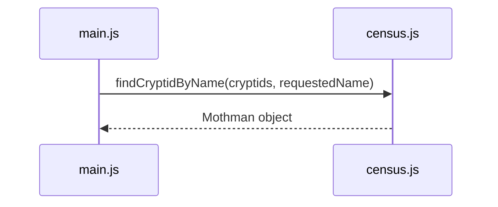

# Sequence Diagrams → Follow the Full Report

Your sequence diagram currently shows the first interaction:



Now continue reading `main.js` from top to bottom.

The goal is not to list every line.

The goal is to record each meaningful call from `main.js` into `census.js` and the result that comes back.

## Trace the code, not the report

After `requestedCryptid` is calculated, the report begins printing.

This line causes the next cross-module call:

```js
console.log(`Confirmed: ${countConfirmed(cryptids)}`);
```

Even though the function call is nested inside a template literal and a `console.log()`, JavaScript still has to call `countConfirmed()` before it can finish constructing the string.

Later, the region report causes another call:

```js
totalSightingsInRegion(cryptids, requestedRegion)
```

So the important module interactions occur in this order:

1. find the requested cryptid,
2. count confirmed cryptids,
3. total sightings for the requested region.

## Label returns with useful results

A return arrow should tell the reader what came back.

For this program:

- `findCryptidByName()` returns the Mothman object,
- `countConfirmed()` returns `6`,
- `totalSightingsInRegion()` returns `15`.

You do not need to paste the entire returned object into the diagram. The label should be precise enough to explain the interaction without turning the diagram into a wall of text.

<HandbookChallenge
  title="Complete the cross-module call sequence"
  hints={[
    <>Keep the existing <code>findCryptidByName()</code> call at the top.</>,
    <>Read <code>main.js</code> downward and add the next imported function invocation when JavaScript reaches it.</>,
    <>Every call to <code>census.js</code> should have a corresponding return arrow back to <code>main.js</code>.</>,
  ]}
  expected={
    <pre className="m-0 whitespace-pre-wrap">{`sequenceDiagram
  participant Main as main.js
  participant Census as census.js
  Main->>Census: findCryptidByName(cryptids, requestedName)
  Census-->>Main: Mothman object
  Main->>Census: countConfirmed(cryptids)
  Census-->>Main: 6
  Main->>Census: totalSightingsInRegion(cryptids, requestedRegion)
  Census-->>Main: 15`}</pre>
  }
  solution={
    <pre className="m-0 whitespace-pre-wrap">{`sequenceDiagram
  participant Main as main.js
  participant Census as census.js
  Main->>Census: findCryptidByName(cryptids, requestedName)
  Census-->>Main: Mothman object
  Main->>Census: countConfirmed(cryptids)
  Census-->>Main: 6
  Main->>Census: totalSightingsInRegion(cryptids, requestedRegion)
  Census-->>Main: 15`}</pre>
  }
>
  <p className="m-0">
    Continue <code>/sequenceDiagram.mmd</code> until it shows all three calls from <code>main.js</code> into <code>census.js</code>, in the order JavaScript actually reaches them. Add the returned result after each call, then preview the finished flow.
  </p>
</HandbookChallenge>

## Check the diagram against the code

A sequence diagram is useful because you can test it against the program.

Point to the first arrow.

Find that call in the code.

Then the second.

Then the third.

If the order in the diagram and the order of execution disagree, fix the diagram.

Next, you will zoom one level deeper and show the repeated work happening inside those Census functions.
