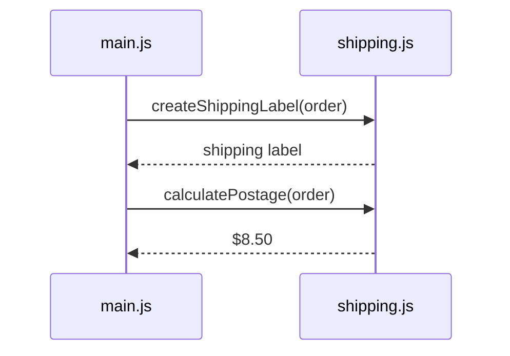

# Sequence Diagrams → Follow the Full Report

Your sequence diagram currently shows the first Census interaction you found on the previous page.

Now you need to continue reading from that point.

The goal is not to list every line.

The goal is to record each meaningful call from `main.js` into `census.js` and the result that comes back.

## Trace the code, not the report

Here is a different program:

```js
const label = createShippingLabel(order);

console.log("======SHIPPING======");
console.log(`Postage: $${calculatePostage(order)}`);
```

Even though `calculatePostage()` appears inside a template literal and a `console.log()`, JavaScript still has to call it before it can finish constructing the string.

The important cross-module interactions are therefore:

1. call `createShippingLabel()`,
2. receive the label,
3. call `calculatePostage()`,
4. receive the postage total.

The matching diagram could be:


```mermaid
sequenceDiagram
  participant Main as main.js
  participant Shipping as shipping.js
  Main->>Shipping: createShippingLabel(order)
  Shipping-->>Main: shipping label
  Main->>Shipping: calculatePostage(order)
  Shipping-->>Main: $8.50
```

## Label returns with useful results

A return arrow should tell the reader what came back. It does not need to reproduce a large returned object. Use a short label that is precise enough to explain the interaction.

Now continue the Census diagram by finding its remaining cross-module calls and the values they return.

<HandbookChallenge
  title="Complete the cross-module call sequence"
  hints={[
    <>Keep the first interaction you already drew at the top.</>,
    <>Read <code>main.js</code> downward and add the next imported function invocation when JavaScript reaches it.</>,
    <>Every call to <code>census.js</code> should have a corresponding return arrow back to <code>main.js</code>. Use the running program to determine useful return labels.</>,
  ]}
  expected={
    <MermaidDiagram source={`sequenceDiagram
  participant Main as main.js
  participant Census as census.js
  Main->>Census: findCryptidByName(cryptids, requestedName)
  Census-->>Main: Mothman object
  Main->>Census: countConfirmed(cryptids)
  Census-->>Main: 6
  Main->>Census: totalSightingsInRegion(cryptids, requestedRegion)
  Census-->>Main: 15`} title="Complete Census call sequence" />
  }
  solution={
    <pre className="m-0 whitespace-pre-wrap">{`sequenceDiagram
  participant Main as main.js
  participant Census as census.js
  Main->>Census: findCryptidByName(cryptids, requestedName)
  Census-->>Main: Mothman object
  Main->>Census: countConfirmed(cryptids)
  Census-->>Main: 6
  Main->>Census: totalSightingsInRegion(cryptids, requestedRegion)
  Census-->>Main: 15`}</pre>
  }
>
  <p className="m-0">
    Continue <code>/sequenceDiagram.mmd</code> until it shows all three calls from <code>main.js</code> into <code>census.js</code>, in the order JavaScript actually reaches them. Add the returned result after each call, then preview the finished flow.
  </p>
</HandbookChallenge>

## Check the diagram against the code

A sequence diagram is useful because you can test it against the program.

Point to the first arrow.

Find that call in the code.

Then the second.

Then the third.

If the order in the diagram and the order of execution disagree, fix the diagram.

Next, you will zoom one level deeper and show the repeated work happening inside those Census functions.
