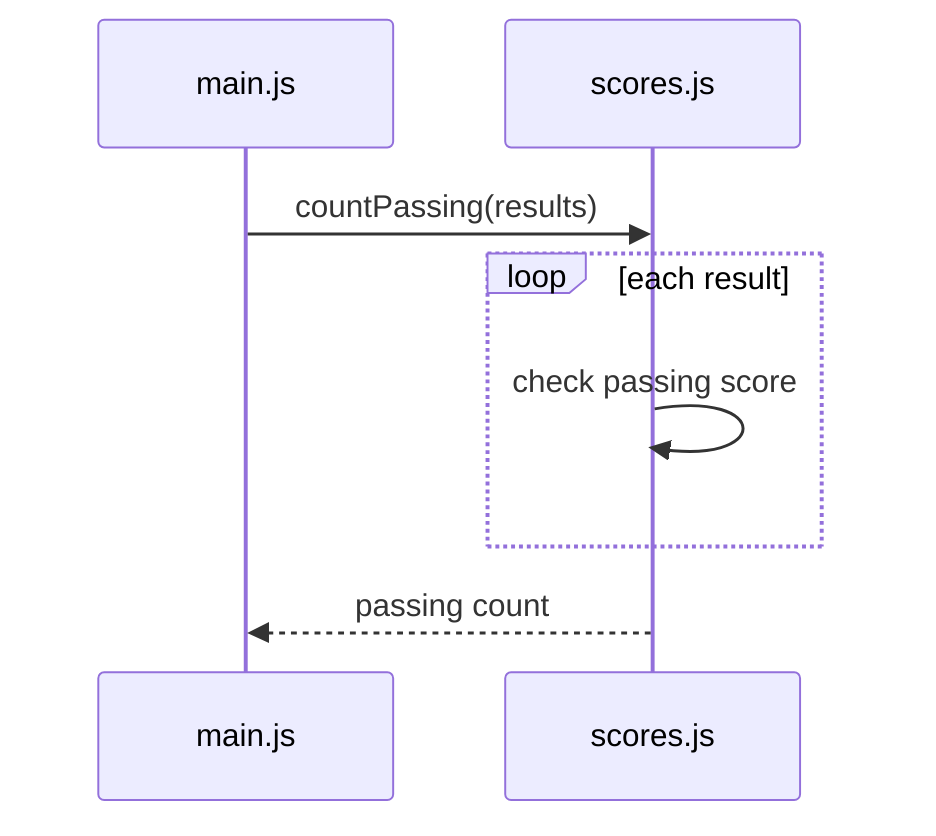

# Sequence Diagrams → Show Repeated Work

The current sequence diagram shows the module calls correctly.

But each Census function does more than receive an argument and instantly return an answer.

Each one loops through the cryptid records.

A sequence diagram can show repeated work with a `loop` block.

## Mermaid loop syntax

Here is a small example:



The syntax is:

```text
loop description of repetition
  interaction inside the loop
end
```

The indentation is for people. `loop` and `end` tell Mermaid where the repeated section begins and ends.

## A module can show work inside itself

This line:

```text
Scores->>Scores: check passing score
```

is a **self-message**.

It shows work happening inside the same participant.

That is useful here because the loop lives inside the function in `census.js`. `main.js` does not make a new call for every cryptid. `census.js` performs that repeated work internally.

## Describe the algorithm, not every statement

For `countConfirmed()`, a useful loop description is:

```text
loop each cryptid
  Census->>Census: check confirmed
end
```

You do not need separate arrows for:

- reading `records[i]`,
- reading `.confirmed`,
- incrementing `count`,
- incrementing `i`.

The diagram should make the algorithm understandable, not duplicate the source code line by line.

The other functions have different repeated jobs:

- `findCryptidByName()` compares normalized names until it finds a match or runs out of records.
- `totalSightingsInRegion()` checks each cryptid and adds sightings for matching regions.

<HandbookChallenge
  title="Add the Census loops to the sequence diagram"
  hints={[
    <>Put each loop after its function-call arrow and before that function's return arrow.</>,
    <>Use a self-message from <code>Census</code> to <code>Census</code> to summarize what one pass of the loop does.</>,
    <>Describe the repeated decision or update, not every JavaScript statement inside the loop.</>,
  ]}
  expected={
    <pre className="m-0 whitespace-pre-wrap">{`sequenceDiagram
  participant Main as main.js
  participant Census as census.js

  Main->>Census: findCryptidByName(cryptids, requestedName)
  loop each cryptid until a match
    Census->>Census: compare normalized names
  end
  Census-->>Main: Mothman object

  Main->>Census: countConfirmed(cryptids)
  loop each cryptid
    Census->>Census: check confirmed
  end
  Census-->>Main: 6

  Main->>Census: totalSightingsInRegion(cryptids, requestedRegion)
  loop each cryptid
    Census->>Census: add matching sightings
  end
  Census-->>Main: 15`}</pre>
  }
  solution={
    <pre className="m-0 whitespace-pre-wrap">{`sequenceDiagram
  participant Main as main.js
  participant Census as census.js

  Main->>Census: findCryptidByName(cryptids, requestedName)
  loop each cryptid until a match
    Census->>Census: compare normalized names
  end
  Census-->>Main: Mothman object

  Main->>Census: countConfirmed(cryptids)
  loop each cryptid
    Census->>Census: check confirmed
  end
  Census-->>Main: 6

  Main->>Census: totalSightingsInRegion(cryptids, requestedRegion)
  loop each cryptid
    Census->>Census: add matching sightings
  end
  Census-->>Main: 15`}</pre>
  }
>
  <p className="m-0">
    Expand <code>/sequenceDiagram.mmd</code> so each Census function call shows the repeated work that happens before its result is returned. Use one <code>loop</code> block and one <code>Census-&gt;&gt;Census</code> self-message for each function.
  </p>
</HandbookChallenge>

## Read the finished sequence

The finished diagram now has two levels:

1. **Between modules** - `main.js` calls functions in `census.js`.
2. **Inside the function module** - `census.js` repeats an operation over the records.

That is enough detail to explain the program without reproducing every line.

Next, you will deliberately break a module connection and use your debugging skills to repair it.
