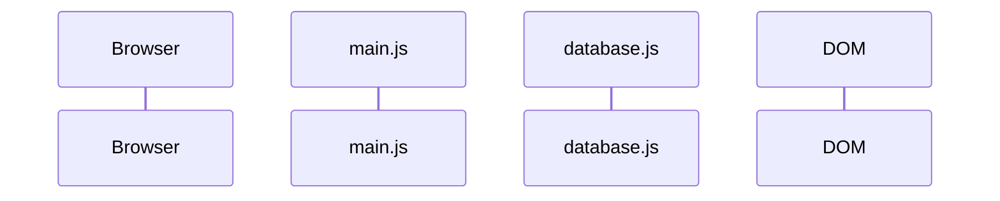
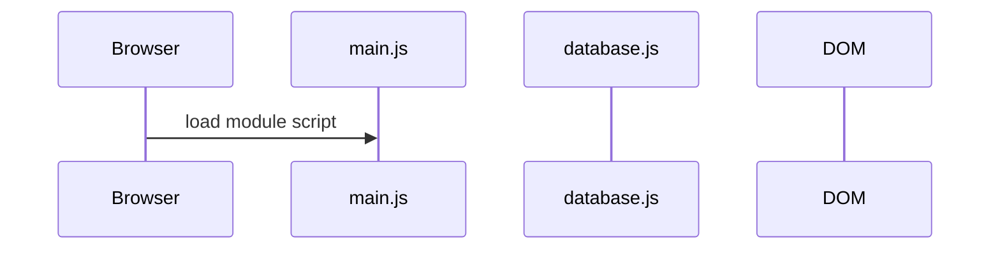

# Flow Diagrams: Tracking What Happens First

We have learned a lot so far.

So far, you have practiced how to:

- store values in variables
- use strings, numbers, booleans, arrays, and objects
- write functions that organize reusable logic
- import code from another file
- use the console to inspect what your code is doing

That is a strong foundation.

But as our programs get bigger, there is another skill that starts to matter more and more:

**keeping track of what happens first.**

Up to this point, most of our JavaScript work has happened in fairly small examples. In smaller programs, it is usually not too hard to keep the order of events in your head. You write some code, the code runs, and you can often see what happened without much trouble.

But as soon as a program starts involving multiple files, the browser, and eventually the DOM, that becomes harder.

The browser has to load the page.

It has to load your JavaScript.

One file may ask another file for data.

Later, JavaScript may update the DOM.

And if those steps happen in the wrong order, things can break in ways that feel confusing.

That is where a sequence diagram can help.

A sequence diagram is not JavaScript. It is a simple visual tool that helps us show what happened, which part of the program was involved, and what happened next.

So before we start learning new DOM methods, we are going to pause for one page and learn how to read that map.

Before we start changing the page with JavaScript, we are going to pause for one page and learn how to track program flow first.

## The Problem: Programs Happen in an Order

When you look at a finished webpage, it can feel like everything just appears.

The page loads. The script runs. The content shows up.

From the outside, it all feels pretty smooth.

But under the hood, the browser is following a sequence of steps.

Before `main.js` can run, the browser has to load it.

Before `main.js` can use code from another file, that code has to be imported.

Before JavaScript can change the page, it has to interact with the DOM.

That means one of the most useful questions you can ask is:

> What happened first?

A sequence diagram helps answer that question.

It gives us a simple way to show the order of events instead of trying to keep the whole flow floating around in our heads at once.

## What Is a Sequence Diagram?

A sequence diagram shows how different parts of a program interact over time.

For this section, we will use it as a simple program flow diagram.

It will help us keep track of things like:

- when the browser loads `main.js`
- when `main.js` asks `database.js` for data
- when `main.js` updates the DOM
- what order those steps happen in

The most important reading rule is simple:

**sequence diagrams read from top to bottom.**

That means higher steps happen earlier, and lower steps happen later.

So if one line appears below another line, it happened after the first one.

That may not sound dramatic, but it turns out to be very useful. A lot of beginner bugs are really order-of-operations bugs wearing a costume.

<Callout type="tip" title="Problem this solves">
  <p className="m-0">When a program involves the browser, JavaScript, data, and the DOM, bugs often come from doing the right step at the wrong time. The diagram gives you a place to track that order before you start changing code.</p>
</Callout>

## The Starter Diagram

Your workbench already includes a file named:

```txt
/sequenceDiagram.mmd
```

That file should start like this:



Right now, this diagram does not show any actions yet.

It only shows the participants.

A **participant** is one part of the program that can be involved in the flow.

For this section, we have four of them.

| Participant | What it represents |
| ----------- | ------------------ |
| `Browser` | The browser that loads the page and runs the app |
| `Main` | The `/scripts/main.js` file you will edit |
| `DB` | The `/scripts/database.js` file that owns the potion data |
| `DOM` | The browser’s live page model that JavaScript can select and update |

Those names are short on purpose.

Diagrams get crowded quickly, so it helps to keep the participant names compact and readable.

You may also notice this line:

```mermaid
participant Main as main.js
```

That means:

> Use `Main` as the participant name in the diagram code, but show `main.js` as the visible label.

So if the preview says `main.js`, that is still the same participant.

Mermaid is just giving us a shorter name for writing the diagram and a clearer name for displaying it.

## What an Arrow Means

Sequence diagrams use arrows to show one participant interacting with another participant.

For example:

```mermaid
Browser->>Main: load module script
```

This means:

> The browser loads and runs `main.js`.

Let’s break that down.

| Code | Meaning |
| ---- | ------- |
| `Browser` | The participant where the action starts |
| `->>` | An arrow showing communication moving forward |
| `Main` | The participant receiving the action |
| `:` | Separates the participants from the description |
| `load module script` | A short description of what happened |

The words after the colon are not JavaScript.

They are just a label for humans.

That label should be short and clear. Its job is to explain the step, not to become a second programming language.

For example, a diagram for loading a starter script could use a line like this:

```mermaid
Browser->>Main: start app code
```

The wording after the colon can change to match the program you are describing. What matters is the order and the relationship: the browser starts the JavaScript file.

## The Diagram Should Match the Current Program

There is one more idea that matters here.

The diagram should match the **current** version of the program.

That means it is not a scrapbook of every old version of your code.

As your code changes, the diagram may need to change too.

Sometimes you will add a new line because the program does something new.

Sometimes you will replace an old line because the wording is no longer accurate.

Sometimes you will move a line because the order changed.

That is normal.

The goal is not to preserve history. The goal is to explain what the program does now.

<HandbookChallenge title="ELM Flow Challenge 1 · Track the module script">

Open `/sequenceDiagram.mmd`.

Then make sure it looks like this:



Preview the diagram.

You should see the browser pointing to `main.js`.

That arrow represents the browser loading and running the module script.

**Check your diagram:**

- Does the diagram still include all four participants?
- Does the browser load `main.js` before any DOM or data work appears?
- Does the arrow label explain what happened in human words?

</HandbookChallenge>

## What You Should Notice

Right now, the diagram is very small.

That is good.

At this point, it only needs to show one main idea:

> The browser loads and runs `main.js`.

We are not selecting anything from the DOM yet.

We are not changing the page yet.

We are not asking `database.js` for potion data yet.

Those steps will come later.

For now, the important thing is simply learning how to read the diagram.

The participant names tell you which parts of the program are involved.

The arrow tells you that one participant interacted with another participant.

The top-to-bottom order tells you what happened first.

That is the whole job of this tool.

It gives you a clear way to describe the program flow without trying to memorize every moving part all at once.

## Technical Vocabulary

| Term | Meaning |
| ---- | ------- |
| sequence diagram | A diagram that shows interactions in order from top to bottom |
| flow | The order that steps happen in a program |
| participant | One part of the program shown in the diagram |
| arrow | A diagram symbol that shows one participant interacting with another participant |
| Mermaid | A text-based diagram syntax that can render diagrams from code-like text |
| `Browser` | The participant that represents the browser loading and running the app |
| `Main` | The participant that represents `/scripts/main.js` |
| `DB` | The participant that represents `/scripts/database.js` |
| `DOM` | The participant that represents the browser’s live page model |

## Wrapping Up

You now have the first version of the program flow diagram.

It does not show much yet, but that is exactly the point.

We are learning the tool before we ask it to carry more weight.

In the next chapter, the browser will turn the page into objects, and JavaScript will select one of those objects using `document`.

When that happens, you will update the diagram again.

Not because the diagram is the star of the show.

It is not.

The star is understanding what your program is doing and when it is doing it.
