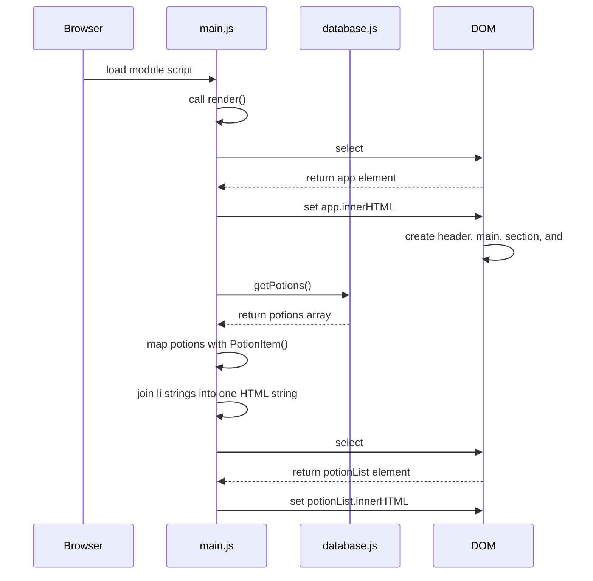

# Render Function · Put the DOM Update in One Place

The page works, but the rendering logic is spread out.

> When code that updates the screen is scattered everywhere, it becomes harder to re-run later.

This prepares you for later chapters, where events and state changes will need to call render logic again.

## Concepts

- A render function groups DOM update logic.
- `render()` can be called once when the page loads.
- Later chapters can reuse this structure.

## Final Code Shape

```js
import { getPotions } from "./database.js";

const PotionItem = (potion) => {
  return `<li>${potion.name}</li>`;
};

const render = () => {
  const app = document.querySelector("#app");

  app.innerHTML = `
    <header>
      <h1>Potion Shelf</h1>
      <p>A tiny catalog for a magical shop.</p>
    </header>

    <main>
      <section>
        <h2>Available Potions</h2>
        <ul id="potion-list"></ul>
      </section>
    </main>
  `;

  const potions = getPotions();
  const potionHTML = potions.map(PotionItem).join("");
  const potionList = document.querySelector("#potion-list");

  potionList.innerHTML = potionHTML;
};

render();
```

<HandbookChallenge
  title="Refactor into render()"
  hints={[
    "Keep the getPotions import at the top.",
    "Select #potion-list after the shell is rendered.",
    "Call render() at the bottom of the file.",
  ]}
  answers={
    <pre className="m-0 whitespace-pre-wrap">{`import { getPotions } from "./database.js";

const PotionItem = (potion) => {
  return \`<li>\${potion.name}</li>\`;
};

const render = () => {
  const app = document.querySelector("#app");

  app.innerHTML = \`
    <header>
      <h1>Potion Shelf</h1>
      <p>A tiny catalog for a magical shop.</p>
    </header>

    <main>
      <section>
        <h2>Available Potions</h2>
        <ul id="potion-list"></ul>
      </section>
    </main>
  \`;

  const potions = getPotions();
  const potionHTML = potions.map(PotionItem).join("");
  const potionList = document.querySelector("#potion-list");

  potionList.innerHTML = potionHTML;
};

render();
`}</pre>
  }
>
  <ul className="mt-2 mb-0 list-disc list-inside px-3">
    <li>Keep the `getPotions` import at the top.</li>
    <li>Keep the `PotionItem` function.</li>
    <li>Create a function named `render`.</li>
    <li>Move the `#app` selection inside `render`.</li>
    <li>Move the app shell rendering inside `render`.</li>
    <li>Move the `getPotions()` call inside `render`.</li>
    <li>Move the `map()` + `join("")` list rendering inside `render`.</li>
    <li>Move the `#potion-list` selection inside `render`, after the shell is rendered and before setting its `innerHTML`.</li>
    <li>Call `render()` at the bottom of the file.</li>
    <li>Refresh and confirm the page still displays every potion.</li>
  </ul>
</HandbookChallenge>

## Keep vs Trash

Keep:

```js
const render = () => {
  // DOM update logic
};

render();
```

Trash all duplicated rendering logic outside `render()`.

---

## Flow Update

Your code changed the program flow. This is the final Chapter 1 diagram refactor.

Update `/sequenceDiagram.mmd` so `main.js` calls `render()` before the detailed render steps:



Then answer:

- Which step starts the render process?
- Which steps happen inside `render()`?
- Which step gets data?
- Which step turns data into HTML?
- Which step updates the DOM?

## Chapter 1 Assessment Target

Students should be able to independently build this flow:

```txt
select mount point
-> render shell
-> select nested list
-> get array data
-> turn one object into one HTML string
-> map all objects into HTML strings
-> join strings
-> set innerHTML
```

## Not Yet

Chapter 1 does not teach `addEventListener()`, `event`, `dataset`, dropdowns, filtering, or transient state. It stops when students can render a clean potion list from data.

## Technical Vocabulary

| Term | Meaning |
| --- | --- |
| render function | A function responsible for updating the DOM |
| refactor | Change code structure without changing behavior |
| single responsibility | Code should have one clear job |
